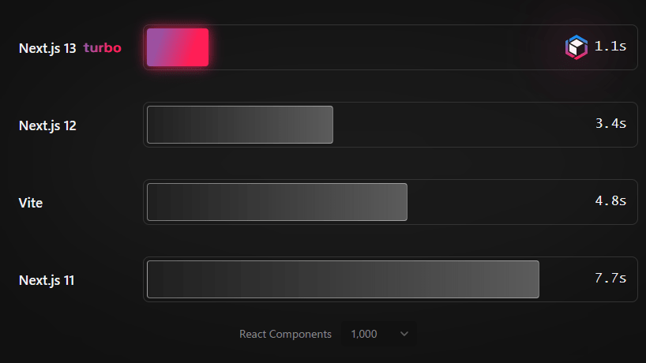
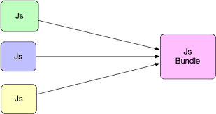
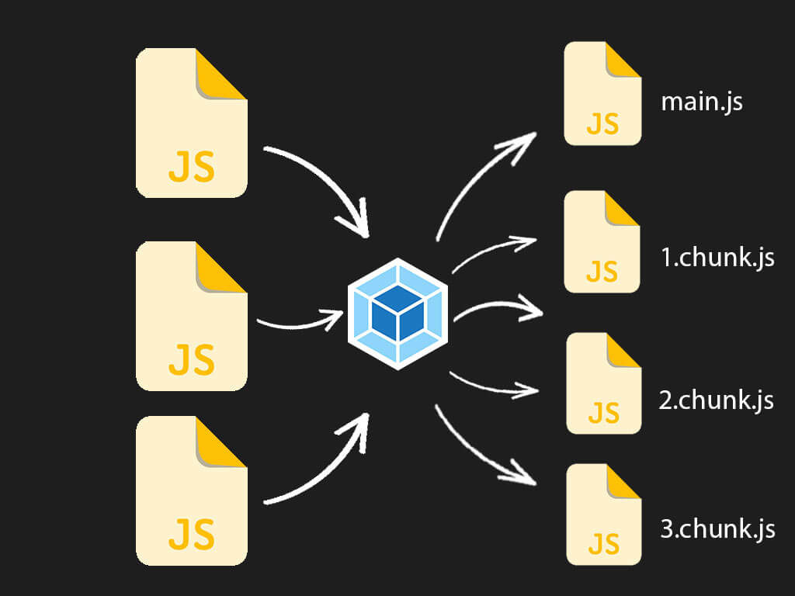
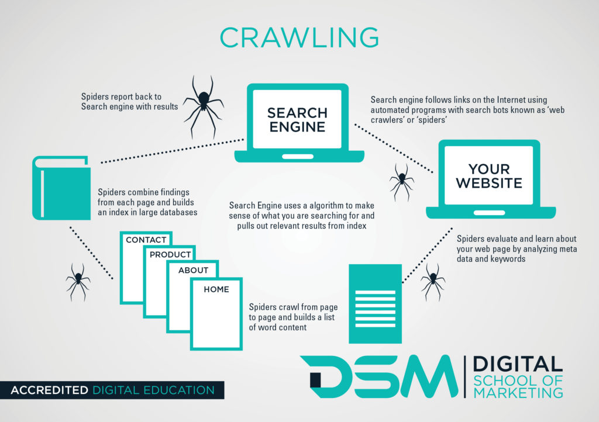

# Next
### Ventajas
#### Popularidad
Tiene mas de 100k de estrellas en Github.
Build rápido

#### Lazy loading y code splitting
Lazy loading: Brindar lo que realmente se necesita

Separa en partes la aplicación para que la pagina que se carga funcione como debe ser unicamente con pocos archivos.

#### Comodo
Ofrece 
- Optimización de imagenes
- Internacionalización
- Next.js Analytics
- Zero config
- Hybrid: SSG and SSR
- Incremental static regeneration
- Typescript support
- Fast Refresh
- File-system Routing
- API routes
- Built-in CSS Support
- Middleware
### SEO (Search Engine Optimization)
Posiciona nuestra aplicación en los motores de busqueda

Es un software automatico que ejecuta todos los links de una pagina.
Un buen SEO asegura mejores posiciones en busquedas.

### Opinado
_*Framework*_ Una forma de hacer las cosas.

_*React*_ Extremadamente flexible, esto mismo es una ventaja como una desventaja. Para una problema se encuentran 1000 solución.

_*Next.js*_ Presenta sus propias soluciones. Se hacen las cosas a su manera.

Estructura Opinada

### Zero config
Un par de lineas de comando y esta listo para utilizar.

### ¿Cuando es mejor usarlo?
* Cuando el enfoque es el SEO
* Cuando el proyecto es un prototipo rapido.
* Cuando se quiere hacer Client Side Rendering.
* Landing page.

### Problemas
Lo mejor es aprender las bases antes de llegar a next.